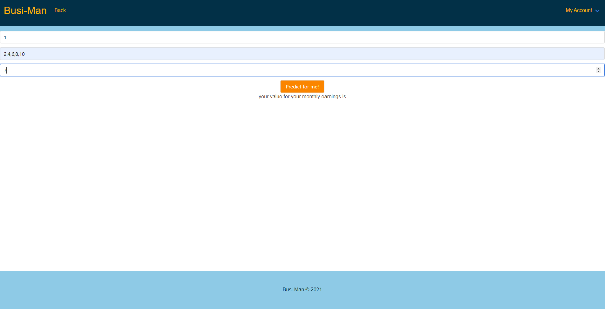
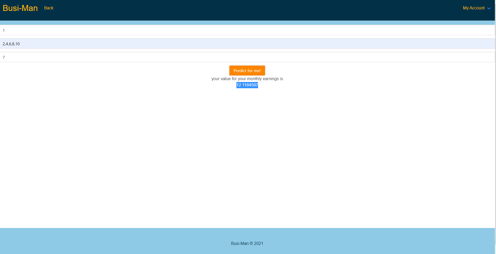

# Busi-Man
A business manager application for small businesses. 

[View the deployed application here](https://busi-man.herokuapp.com/)
* Log in to test account:
    * email: michaelscott@company.com
    * password: dwight

## Table of Contents
* [Description](#description)
    * [Features](#features)
* [Usage](#Usage)
    * [Signing up](#signing-up)
    * [Using the barcode scanner](#using-the-barcode-scanner)
    * [Adding Employees](#adding-employees)
    * [Using the prediction feature](#using-the-prediction-feature)
* [Technologies](#technologies)
* [Installation](#installation)
* [License](#license)
* [Created by](#created-by)

## Description
Busi-Man is a comprehensive business manager app which keeps track of employees, sales and inventory. 

### Features

#### Adding employees 
* Busi-Man allows you to add employees as either a manager or a regular employee, so everyone in your business can view the same information. Managers have access to all app features, while regular employees only have access to the make a sale, receive items, and track inventory pages. 

#### Barcode scanner
* Busi-Man barcode scanner functionality makes adding to inventory and making a sale easy. The barcode scanner only requires a smartphone and the Scan to Web app. 

#### View inventory and transactions
* View inveintory gives you a list of all the items in inventory with their barcodes, count, and price. View transactions gives a list of all the transactions made, with the date and employee name attached.

#### Post announcement
* Managers can post announcements that are visible to all employees

#### Predict feature
* Use the predict feature, which utilizes a the machine learning API TensorFlow, to predict future revenue or expenses based on past data.

## Usage

#### Signing up
* The sign up can only be done by one person, since company name must be unique on sign up. After sign up, you may add as many employees as you like under one company.

#### Using the barcode scanner
* To use the barcode scanner, download the [Scan to Web](https://play.google.com/store/apps/details?id=com.berrywing.scantoweb&hl=en_US&gl=US) app on your phone. 

* Enter the Busi-Man web address in the top left corner of the Scan to Web app. Then log in using your Busi-Man account. 
* To receive items or make a sale, click on the barcode scanner link. The barcode scanner will open in the camera.
* Save the barcode along with the quantity. For receive items, if the item is not already in inventory, you will be prompted to add the item name and price and then save the item again.
* For make a sale, you can scan as many items as you like and receive a running total of the sale cost. To begin a new sale, click 'Done'. 

#### Adding Employees

* To add an employee, enter the employee name email and manager status. When you click 'Add Employee', a random password will appear. Click the link below to send an email to the employee with their password. 
* When newly added employees log into the app for the first time they will be prompted to change their password. 

#### Using the prediction feature
* The prediction feature is using Tensorflow.js an open source platform for machine learning. Here in the picture below, it shows us couting by twos up to 10, if we were to take that series and essentially count from 0 by twos and predict the 7th outcome in the series us as humans know that it will be 12.
The computer however trains the model to learn the sequence and find the output for the given value, in this case being 7.
* What do these values mean? The first one is expenses and takes in your expenses. Second takes in your Total Monthly Earnings each month (or you can calculate per year even!). Lastly you will count how many months from the certain data you want to predict then add one. IE: i enter in 2,4,6,8 so thats 4 months then i add one thats 5 so i can ask to predict anything above 5 thats a whole number and the machine will calculate for us. Note: the more data given to the machine, the more accurate it is.

next we show the value being outputted after its calculated

## Technologies
* [Scan to Web app](https://play.google.com/store/apps/details?id=com.berrywing.scantoweb&hl=en_US&gl=US)
* [TensorFlow](https://www.tensorflow.org/)
* [Bulma (CSS library)](https://bulma.io/)
* React
* Node.js
* MongoDB

## Installation
* Install dependencies by running `npm i` on your machine.

## License
Licensed under the [MIT](https://opensource.org/licenses/MIT) license.

## Created by 

* [Lydia Newman-Heggie](https://github.com/lnewmanheggie)
* [Hayden Garrard](https://github.com/H-garr)
* [Gustaf Campoy](https://github.com/Gustaf-987)